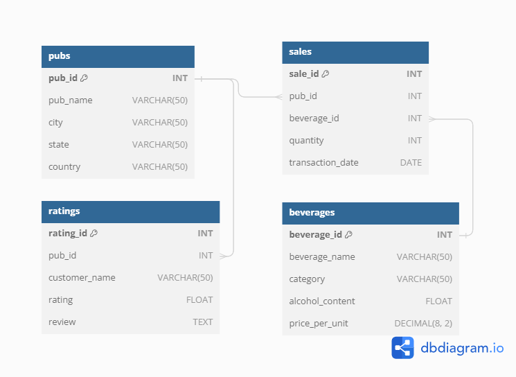
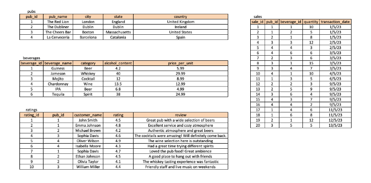

# Challenge 5 - Pub Pricing Analysis

## Problem Statement
As a Pricing Analyst at pub chain called 'Pubs "R" Us', we have been tasked with analysing the drinks prices and sales to gain a greater insight into how the pubs in our chain are performing.

## Entity Relationship Diagram

## Tables

## Questions

1. How many pubs are located in each country?
2. What is the total sales amount for each pub, including the beverage price and quantity sold?
3. Which pub has the highest average rating?
4. What are the top 5 beverages by sales quantity across all pubs?
5. How many sales transactions occurred on each date?
6. Find the name of someone that had cocktails and which pub they had it in.
7. What is the average price per unit for each category of beverages, excluding the category 'Spirit'?
8. Which pubs have a rating higher than the average rating of all pubs?
9. What is the running total of sales amount for each pub, ordered by the transaction date?
10. For each country, what is the average price per unit of beverages in each category, and what is the overall average price per unit of beverages across all categories?
11. For each pub, what is the percentage contribution of each category of beverages to the total sales amount, and what is the pub's overall sales amount?
    
Access solutions [Here](./Challenge_5.sql)
